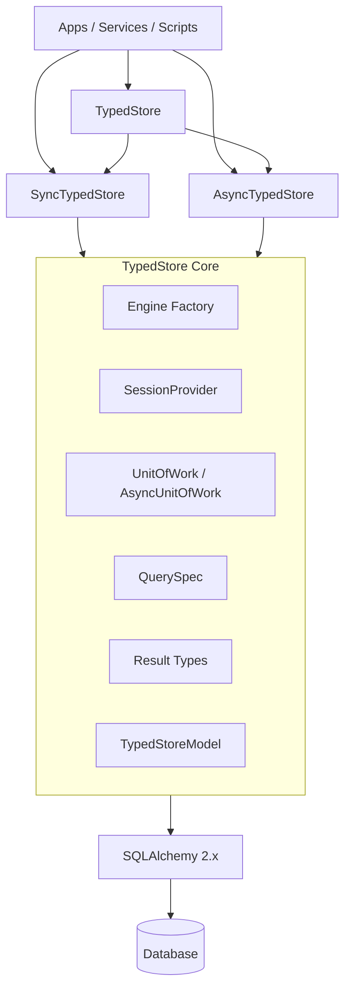

# TypedStore

## Overview

`TypedStore` 是计划在当前仓库中实现的一层“类型优先的数据访问 SDK”。

它的目标不是替代 SQLAlchemy，也不是重新实现一个通用 ORM，而是在保留 SQLAlchemy 2.x 模型映射、表达式系统和会话能力的前提下，提供一组更稳定、更可组合、更适合业务开发的 typed data access abstraction。

这个主题的起点来自一个已存在的 `DBORM` 实践：它已经证明“轻量 CRUD facade + 模型 mixin + session 封装”对业务开发有价值，但也暴露了类型不稳定、sync/async 语义不一致、初始化耦合过重等问题。当前仓库将把这些经验收敛成一个更适合长期演进的 SDK。

## Goals

- 在当前仓库内实现 `TypedStore` 作为 SDK 主体，而不是继续堆叠临时 CRUD helper
- 明确 `TypedStore` 的定位：typed data access SDK on top of SQLAlchemy
- 保持 `AGENTS first` 和 `code as SSOT` 的工作方式，使设计、实现、进度追踪可恢复
- 把数据访问能力拆分为稳定边界：engine、session、unit of work、query spec、result types、optional model mixin
- 将 sync / async API 明确拆分为两个 facade，避免一个类同时承载双重语义
- 为后续实现与迭代建立清晰的里程碑、验证策略和迁移路线

## Non-goals

- 不重新发明 SQLAlchemy 的映射系统
- 不实现一个自定义 SQL DSL 去替代 SQLAlchemy expression system
- 不把所有复杂查询都强制塞进新抽象层
- 不在导入期创建 schema、绑定副作用或偷渡环境依赖
- 不为了“看起来像 ORM”而模糊 API 边界
- 不再维护旧 `DBORM` 风格兼容层作为长期 public API

## Naming and Positioning

### Why `TypedStore`

选择 `TypedStore` 的原因：

- `Typed`：直接强调该 SDK 的核心主张是“类型系统优先”
- `Store`：表达“持久化访问入口 / 数据访问门面”，但不过度承诺自己是一个完整 ORM
- 相较 `DBORM`、`MiniORM`、`LightORM` 等名字，`TypedStore` 更准确地描述它与 SQLAlchemy 的关系：建立在其上，而不是替代它

### Precise positioning

`TypedStore` 的定位：

- 当前仓库的主实现主题之一
- 一个类型优先的数据访问 SDK
- 默认服务 repository / service 层，也可为模型提供有限的 Active Record 风格语法糖
- 先服务自己的项目，再考虑是否具备对外复用价值

## Design Principles

### Type-first

- 同一方法不返回多种不稳定结果形态
- 优先用泛型、结果类型、规格对象表达 contract
- 减少裸 `dict` 与 `Any`

### SQLAlchemy-native

- 底层继续以 SQLAlchemy 2.x 为单一事实来源
- 复杂查询允许原生 `select()` escape hatch
- 不自造一套与 SQLAlchemy 平行的 DSL

### Explicit sync / async boundaries

- `SyncTypedStore` 专注同步数据访问
- `AsyncTypedStore` 专注异步数据访问
- `TypedStore` 仅作为聚合入口，而不是主行为载体

### Explicit boundaries

- engine / session / uow / facade / model mixin 分层清晰
- 不把副作用初始化和业务语义混在一个文件里

### Recoverable development

- 设计文档、工作流文档、进度文档可支持任务恢复
- 任何设计决策都应能指向后续代码和验证证据

## Target Architecture



### Implemented package layout

```text
./typed_store/
  __init__.py
  async_store.py
  engine.py
  errors.py
  model.py
  query_spec.py
  results.py
  session.py
  store.py
  sync.py
  uow.py
```

说明：

- `sync.py` 与 `async_store.py` 是正式 facade
- `store.py` 提供组合入口 `TypedStore`
- `model.py` 提供可选 mixin，不作为唯一数据访问入口
- `results.py` 用于消除“一个 API 多种返回结构”的问题

## Core Concepts

### SessionProvider

职责：

- 创建 sync / async session
- 统一 rollback / close / 错误处理
- 允许测试注入与替换

### UnitOfWork

职责：

- 定义事务边界
- 适合 service 层组合多步写操作
- 让事务语义从 repository 细节中抽离

### QuerySpec

建议承载：

- `filters`
- `order_by`
- `limit`
- `offset`
- `columns`
- `options`

设计目标：

- 把查询意图建模为稳定对象
- 提高组合性与可测试性
- 保持与 SQLAlchemy expression 兼容

### Result Types

当前 API 已拆分为明确入口：

- `get(model, id)` -> `T | None`
- `find_one(model, spec)` -> `T | None`
- `find_many(model, spec)` -> `list[T]`
- `paginate(model, spec)` -> `Page[T]`
- `select_rows(...)` -> `list[RowLike]`
- `select_scalars(...)` -> `list[TScalar]`

### TypedStoreModel

定位为可选语法糖：

- 保留简单 `insert()` / `ainsert()` 风格
- 不承载复杂查询编排
- 不让模型自行掌握事务策略
- 通过默认 store 或显式 store 解析 sync / async facade

## Implementation Status

当前已实现：

- engine 构造与 bundle
- sync / async session provider
- sync / async unit of work
- `QuerySpec`
- `Page`
- `SyncTypedStore`
- `AsyncTypedStore`
- `TypedStore` 组合入口
- `TypedStoreModel`
- 同步与异步主路径测试
- 事务回滚测试
- 外部 session 复用测试
- loader options 测试
- examples
- async repository / service example
- 错误边界测试
- examples smoke tests
- CI workflow
- Release workflow（GitHub Release -> build -> PyPI Trusted Publishing）

## Validation

当前最低验证矩阵：

| 改动类型 | 最低验证 |
|---|---|
| facade 行为 | `uv run pytest` |
| transaction 语义 | rollback / external session tests |
| loader options | eager load regression tests |
| examples | 通过 `tests/test_examples.py` 做可执行 smoke 校验 |
| error boundaries | 缺失 session factory、错误 store 绑定、投影分页误用测试 |
| CI workflow | GitHub Actions 执行 ruff / ty / pytest 全链路检查 |
| release workflow | GitHub Release 触发检查、构建 dist，并通过 Trusted Publisher 发布到 PyPI |

当前最低验证命令：

```bash
uv run pytest
uv run ruff check .
uv run ruff format --check .
uv run ty check
uv build
```

## References

- `AGENTS.md`
- `docs/internal/workflow.md`
- `README.md`
- `docs/internal/progress.md`
- `examples/sync_basic.py`
- `examples/async_basic.py`
- `examples/repository_pattern.py`
- `examples/async_repository_pattern.py`
- `tests/test_error_boundaries.py`
- `.github/workflows/ci.yml`
- `.github/workflows/release.yml`
- `docs/publishing.md`
