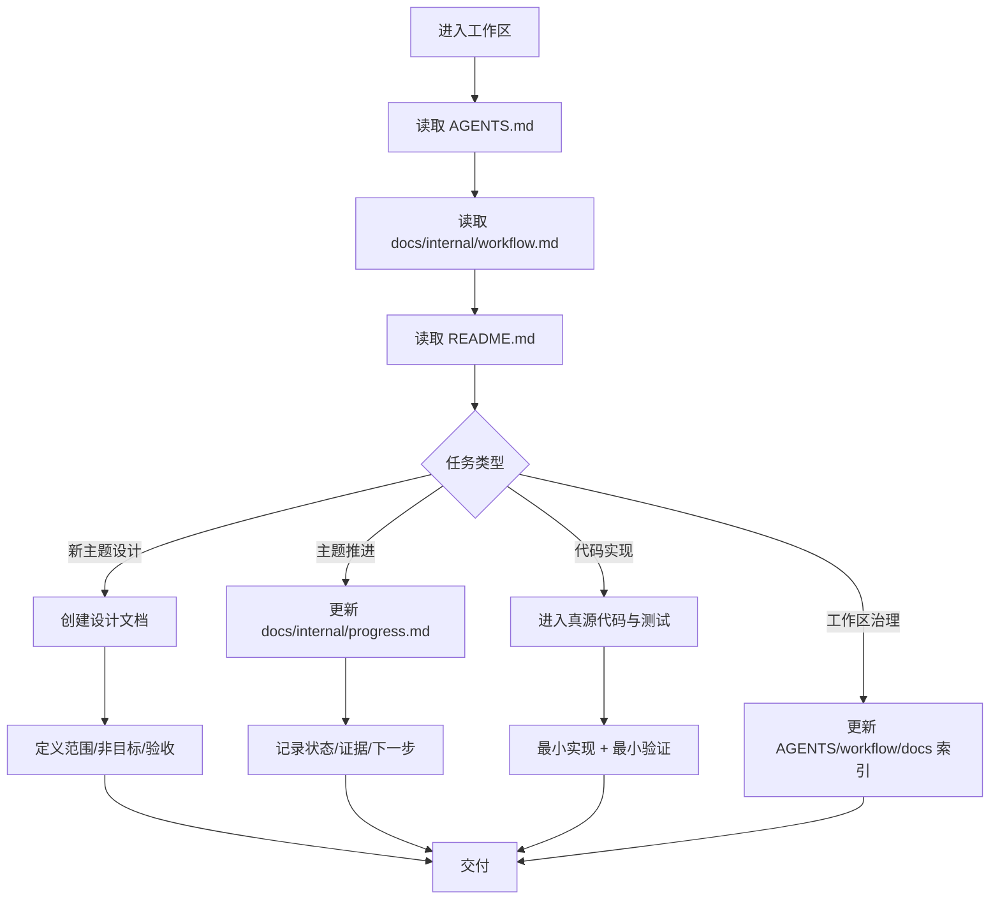
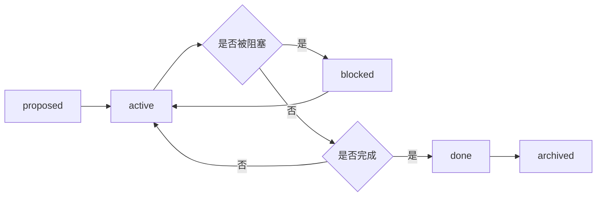
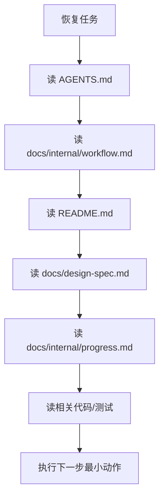

# Workspace Workflow

本文档定义当前工作区的默认研发工作流。目标不是制造一套沉重流程，而是让这里的工作方式满足三个要求：

- 先看规则再行动
- 以代码和测试作为行为真源
- 任务推进过程可恢复、可追踪、可交接

## 工作区模型



## 1. Default Start Sequence

每次开始任务时，按以下顺序进行：

1. 读 `AGENTS.md`
2. 读 `docs/internal/workflow.md`
3. 读 `README.md`
4. 判断是：
   - 工作区治理任务
   - 新主题设计任务
   - 既有主题推进任务
   - 代码实现任务
5. 找到该任务的真源与对应的设计/进度文档

判定时优先问：

- 这次要改的是规则、流程、设计，还是代码？
- 真源文件在哪？
- 是否已有对应主题文档？
- 是否需要补一份进度追踪文档？

## 2. Theme Lifecycle

每个主题建议经历以下生命周期：



### 2.1 Proposed

适用于：

- 新想法
- 新模块
- 新主题设计
- 尚未进入实现的任务

动作：

- 建立设计文档（如 `docs/design-spec.md` 或独立设计文档）
- 若主题很快进入执行，在 `docs/internal/progress.md` 中登记追踪

### 2.2 Active

适用于：

- 正在推进的设计或实现主题

动作：

- 维护 `docs/internal/progress.md`
- 记录最近完成事项、下一步、验证证据
- 保持内容简洁，可供下次恢复直接使用

### 2.3 Blocked

适用于：

- 被外部依赖、关键决策或缺失信息阻塞的主题

动作：

- 在 `docs/internal/progress.md` 明确阻塞原因
- 写清恢复条件
- 不要让"阻塞"只停留在聊天记录里

### 2.4 Done / Archived

适用于：

- 主题功能已交付并完成最小验证

动作：

- 在 `docs/internal/progress.md` 标记为 `done`
- 如后续很少再修改，可将其索引为 `archived`
- 相关长期结论应沉淀到 `docs/` 或模块 README，而不是只留在进度文档

## 3. Directory Responsibilities

### 3.1 Root

- `AGENTS.md`：长期规则
- `README.md`：仓库入口与阅读地图

### 3.2 `docs/`

- `docs/README.md`：文档索引
- `docs/api-surface.md`：API 参考
- `docs/design-spec.md`：设计规格
- `docs/publishing.md`：发布指南
- `docs/internal/`：内部开发文档（工作流、进度、模板）

### 3.3 Code and tests

- 代码与测试负责表达真实行为
- 文档只指向、解释、组织它们，不替代它们

## 4. Progress Tracking Contract

进度文档（`docs/internal/progress.md`）建议使用以下结构：

```markdown
# <Topic>

- Status: active
- Owner: human / agent / mixed
- Spec: docs/design-spec.md
- Code SSOT: <paths>
- Last Updated: YYYY-MM-DD

## Goal

## Current State

## Done

## Next

## Evidence

## Risks / Blockers
```

要求：

- `Code SSOT` 必须给出主要代码路径
- `Evidence` 至少引用文件、测试、脚本或验证命令
- `Next` 应该是一个最小可执行动作，而不是空泛愿景

## 5. Design-first but not doc-heavy

工作方式强调"先设计后实现"，但不追求文档负担过重：

- 简单改动：可直接实现，只在进度文档记录最小证据
- 多步骤改动：先补设计文档
- 长周期主题：同时维护设计文档和进度文档
- 纯规则 / 工作流调整：优先更新 `AGENTS.md` 与 `docs/internal/workflow.md`

## 6. Validation Matrix

| 改动类型 | 最低验证 |
|---|---|
| 工作区规则 | 阅读顺序、作用域、目录职责自洽 |
| workflow 调整 | 恢复路径、状态流转、目录职责自洽 |
| 设计文档 | 范围、非目标、验收与路径引用一致 |
| 进度更新 | 状态、代码真源、证据、下一步完整 |
| 代码实现 | 最小运行、测试或手动验证闭环 |

优先级：

1. 最小可复现
2. 与改动同层
3. 能支持下次恢复

## 7. Recovery Procedure

中断后恢复时，使用以下流程：



恢复时优先输出这五个答案：

- 当前主题
- 当前状态
- 代码真源
- 下一步动作
- 风险 / 阻塞

## 8. Handoff Rules

交接时不要只说"差不多完成了"，而要能落到文件和证据：

- 主题文档在哪
- 进度文档在哪
- 代码真源在哪
- 已验证什么
- 还剩什么

若当前改动调整了工作区治理方式，应同步更新：

- `AGENTS.md`
- `docs/internal/workflow.md`
- `README.md`
- `docs/README.md`
