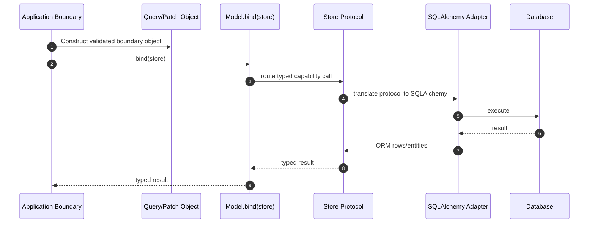
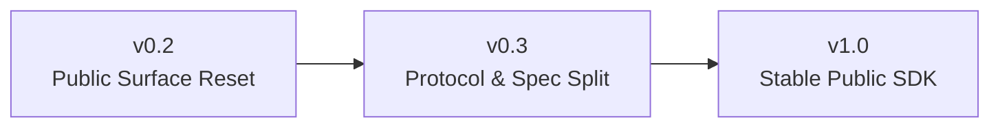

# TypedStore Public SDK Protocol-First Design

## Overview

TypedStore 将从“基于 SQLAlchemy 的 typed CRUD facade”演进为一个面向外部发布的 public SDK。

本设计把 `protocol first` 作为最高优先级：先定义稳定的能力协议和请求协议，再由 `SyncTypedStore` / `AsyncTypedStore` 作为 SQLAlchemy 适配实现去承载这些协议。SDK 不以运行时重复校验为中心，而以协议、类型和显式绑定关系为中心；运行时只保留少量配置错误与 contract violation 的保护。

## Design Goals

- 将项目明确收口为面向外部用户的 public SDK，而不是仅面向当前工作区的内部 helper
- 以 `protocol first` 方式重建 public surface，让 capability protocol 成为核心真源
- 保留模型定义后的“一等操作能力”，但只通过纯函数式 `Model.bind(store)` 暴露
- 将数据校验限制在系统边界处一次完成，SDK 内部默认信任已满足协议的输入对象
- 保持显式 sync / async 边界，不让 bundle 或 convenience API 再次模糊主路径
- 为后续 `v0.2 -> v0.3 -> v1.0` 的演进建立清晰兼容策略

## Non-goals

- 不把 TypedStore 设计成另一个完整 ORM
- 不引入额外的运行时 validation pipeline 来替代静态类型和协议
- 不在核心 API 中继续依赖全局默认 store、类级隐式绑定或隐藏状态
- 不强行把所有复杂 SQLAlchemy 查询包进一个万能 spec 对象
- 不为了保留旧 API 手感而牺牲 public SDK 的边界清晰度

## Positioning

TypedStore 的目标定位为：

- 一个面向外部发布的 typed data access SDK
- 其核心价值不是“少写几行 CRUD”，而是“提供稳定、显式、可组合的协议化数据访问边界”
- SQLAlchemy 2.x 是当前首个正式后端实现，而不是整个设计的唯一形态
- 模型能力是一等能力，但模型通过 `bind(store)` 获取 store capability，而不是携带隐式全局状态

## Core Principles

### Protocol First

- 先定义能力协议，再定义具体 store 类
- 先定义查询/变更请求协议，再决定 SQLAlchemy 如何映射这些请求
- public API 的稳定性优先于 facade 写法的简短性

### Boundary Validation Only

- 业务数据的合法性不在 SDK 内重复校验
- `Query[T]`、`Patch[T]`、`PageRequest` 等协议对象一旦进入 SDK，即默认视为已满足边界约束
- SDK 仅保留少量运行时保护：
  - sync / async 适配器误用
  - store 缺失所需 capability
  - session / engine 未配置
  - entity API 与 projection API 的明显 contract violation

### Explicit Binding

- 模型能力只通过 `Model.bind(store)` 获取
- `bind()` 是纯函数式能力绑定，每次返回新的 bound view，不在模型类上留下状态
- 同一模型可同时绑定多个 store，不引入共享类级状态

### Explicit Sync / Async

- `SyncTypedStore` 与 `AsyncTypedStore` 分别实现对应协议
- `TypedStore` 若保留，只作为装配/组合入口存在，不再作为主工作对象
- 用户的主心智模型应始终是“先选 sync 或 async，再绑定模型”

## High-Level Architecture

```mermaid
flowchart TB
    UserCode[User Code] --> ModelBind[Model.bind(store)]
    UserCode --> SyncStore[SyncTypedStore]
    UserCode --> AsyncStore[AsyncTypedStore]

    ModelBind --> BoundView[BoundModelView[T]]

    subgraph ProtocolLayer[Protocol Layer]
        Readable[ReadableStoreProtocol[T]]
        Writable[WritableStoreProtocol[T]]
        Patchable[PatchableStoreProtocol[T]]
        Deletable[DeletableStoreProtocol[T]]
        Tx[TransactionalStoreProtocol]
        Exec[StatementExecutorProtocol]
    end

    subgraph SpecLayer[Spec Layer]
        Query[Query[T]]
        PageRequest[PageRequest]
        Patch[Patch[T]]
        Projection[ProjectionQuery[R]]
    end

    BoundView --> ProtocolLayer
    SyncStore --> ProtocolLayer
    AsyncStore --> ProtocolLayer
    ProtocolLayer --> SpecLayer
    SyncStore --> SQLAlchemy[SQLAlchemy 2.x Adapter]
    AsyncStore --> SQLAlchemy
    SQLAlchemy --> DB[(Database)]
```

## Public API Shape

### 1. Capability Protocols

Capability protocol 是 public surface 的主骨架。

建议引入以下协议：

- `ReadableStoreProtocol[T]`
  - `get(model, ident)`
  - `find_one(model, query)`
  - `find_many(model, query)`
  - `exists(model, query)`
  - `count(model, query)`
  - `paginate(model, query, page)`
- `WritableStoreProtocol[T]`
  - `insert(entity)`
  - `insert_many(entities)`
- `PatchableStoreProtocol[T]`
  - `update(model, query, patch)`
- `DeletableStoreProtocol[T]`
  - `delete(model, query)`
- `TransactionalStoreProtocol`
  - `unit_of_work()`
  - 对应 session scope 能力
- `StatementExecutorProtocol`
  - 面向 SQLAlchemy 原生 statement 的 escape hatch

这些协议的意义是：

- 用户可以依赖最小能力集合而不是依赖整个具体类
- 模型绑定视图可以面向协议组合，而不是面向某个具体 facade
- 后续可在不修改模型 API 的情况下替换具体 store 实现

### 2. Spec Protocols

Spec 层不再由一个大一统 `QuerySpec` 承载所有语义，而是拆分成更稳定的小对象。

建议引入：

- `Query[T]`
  - 表达实体查询条件
  - 承载 `filters / order / limit / offset / options`
- `PageRequest`
  - 表达分页请求
  - 初期为 `limit / offset`
  - 后续若有需要再扩展 cursor pagination
- `Patch[T]`
  - 表达字段变更意图
  - 只承载“改什么”，不混入查询语义
- `ProjectionQuery[R]`
  - 承载投影查询与行结果类型
  - 与实体查询显式分离

拆分原则：

- capability protocol 定义“能做什么”
- spec protocol 定义“本次请求要怎么做”
- 不再让一个对象同时承载 entity query、projection、pagination、update、delete 的全部语义

### 3. Store Implementations

`SyncTypedStore` / `AsyncTypedStore` 继续保留，但职责需要收紧：

- 作为 capability protocol 的正式 SQLAlchemy 实现
- 负责 SQLAlchemy session/engine 的适配
- 暴露显式生命周期 API：
  - `dispose()`
  - `close()`
  - `aclose()`（异步）
- 提供模型绑定所需协议能力

这两个对象是 public SDK 的正式主入口，而不是“临时 facade”。

### 4. Model-First Capability

模型能力是一等能力，但必须遵守显式绑定原则。

推荐主路径：

```python
User.bind(store).find_many(...)
User.bind(store).get(...)
User.bind(store).insert(user)
```

设计约束：

- 只保留 `bind(store)`，不再以全局默认 store 或类级隐式绑定作为核心设计
- `bind(store)` 返回 `BoundModelView[T]`
- `BoundModelView[T]` 是正式 public object，而不是内部 helper
- 多态继承场景下，只要模型基类实现了绑定协议，其子类天然继续具备同样能力

### 5. BoundModelView

`BoundModelView[T]` 负责把“模型类型”和“store capability”组合成一等可用对象。

建议其能力包括：

- `get(ident)`
- `find_one(query | filters...)`
- `find_many(query | filters...)`
- `exists(query | filters...)`
- `count(query | filters...)`
- `paginate(query, page)`
- `insert(entity)`
- `insert_many(entities)`
- `update(query, patch)`
- `delete(query)`

其职责是：

- 对用户提供最自然的模型操作入口
- 对内只做能力路由，不承载额外状态或独立业务逻辑

## TypedStoreModel Redesign

`TypedStoreModel` 保留为一等能力，但定位发生变化：

- 当前版本：偏 Active Record 风格语法糖，并混入全局默认 store 的绑定思路
- 目标版本：模型侧能力协议的承载者，为模型提供标准化 `bind(store)` 能力

重构后的职责：

- 提供 `bind(store)` classmethod
- 在类型层声明“该模型可绑定到 store capability”
- 为多态继承场景提供统一能力入口

不再作为核心 public API 的内容：

- 全局默认 store
- `set_default_store()`
- `get_default_store()`
- 基于全局/类级状态直接调用 `User.find_many()` 的主路径心智模型

## Data and Error Handling Model

### Data Flow



### Validation Policy

- 应用边界负责构造已满足约束的协议对象
- SDK 内部不重复验证 `Query` / `Patch` / `PageRequest`
- 对外文档需要明确指出：TypedStore 依赖 protocol contract，而不是 runtime schema validation

### Error Policy

保留的错误类型应聚焦于：

- 配置错误
  - 缺失 session factory
  - 缺失 engine
  - sync / async 错误绑定
- contract violation
  - 在 entity API 上传入 projection query
  - 在只读 capability 上调用写操作
- adapter misconfiguration

不建议继续扩大的错误面：

- 重复的数据合法性校验错误
- 面向业务域的字段级校验错误

## Public Surface Adjustments

### Keep and Strengthen

- `SyncTypedStore`
- `AsyncTypedStore`
- `TypedStoreModel`
- `UnitOfWork` / `AsyncUnitOfWork`
- `Page`
- `SessionProvider` 作为高级入口

### Redesign

- `QuerySpec` -> 拆分为多个 spec objects
- `SyncModelStore` / `AsyncModelStore` -> 收敛为 `BoundModelView[T]`
- `update_fields()` -> `update(query, patch)`
- `delete_where()` -> `delete(query)`

### Deprecate

- `TypedStore` 直接作为 sync CRUD facade 的主路径
- `TypedStore` 上的 sync delegate 方法
- 全局默认 store 相关 API
- 文档和示例中所有“模型天然持有 store 状态”的心智模型

## Versioned Migration Strategy



### v0.2

目标：

- 先修正 public 心智模型
- 让新用户学习到正确主路径

范围：

- 引入 `bind()` 与 `BoundModelView[T]`
- 文档和 examples 迁移到 `Model.bind(store)` 主路径
- 增加 store 生命周期 API
- 为 `TypedStore` sync delegate 与全局默认 store 引入弃用说明
- 统一错误分层

### v0.3

目标：

- 兑现 `protocol first`
- 让代码结构与 public surface 对齐

范围：

- 引入 capability protocols
- 拆分 `QuerySpec`
- 迁移更新/删除语义到 `update(query, patch)` / `delete(query)`
- 让 store 和模型绑定视图显式面向 protocol 编程

### v1.0

目标：

- 发布稳定 public SDK
- 移除旧心智模型

范围：

- 移除全局默认 store 路径
- 移除 `TypedStore` 的 sync delegate 主路径
- 正式冻结或淘汰旧 `QuerySpec`
- 完成类型收紧与外部集成文档
- 建立兼容与弃用策略

## Compatibility Notes

- `v0.x` 期间允许兼容层存在，但兼容层不再作为主路径推荐
- README、API surface、examples、tests 的主叙述必须与新设计保持一致
- 所有弃用项都应有明确迁移路径：
  - `User.find_many(...)` -> `User.bind(store).find_many(...)`
  - `TypedStore.find_many(Model, ...)` -> `SyncTypedStore.find_many(...)` 或 `Model.bind(store).find_many(...)`
  - `QuerySpec(...)` -> 对应的 `Query[T]` / `ProjectionQuery[R]` / `PageRequest`

## Acceptance Criteria

当以下条件满足时，可认为本设计落地成功：

- public README 的主路径已改为 `Model.bind(store)` 和显式 sync / async store
- `SyncTypedStore` / `AsyncTypedStore` 已被表达为 capability protocol 的实现
- `TypedStoreModel` 已重构为绑定能力入口，而非隐式状态语法糖
- 数据校验策略已在文档中明确为“边界一次校验，内部不重复校验”
- `TypedStore` 已被降级为组合入口而非主工作对象
- 旧 API 的弃用路径和迁移指南已完整可用

## Open Implementation Questions

以下问题属于 implementation planning 阶段决策，而不是本设计的未完成项：

- capability protocols 应该按文件拆分还是集中定义
- `Query[T]` 是否在首版保留 `*filters` 快捷路径
- `ProjectionQuery[R]` 的结果类型如何在不引入过多复杂度的前提下表达
- bulk update/delete 的 SQLAlchemy 实现是否在 `v0.3` 就切换为 SQL 级语义，还是先保留对象级兼容层

这些问题不会改变本设计的核心方向，只影响实施顺序与兼容策略。
